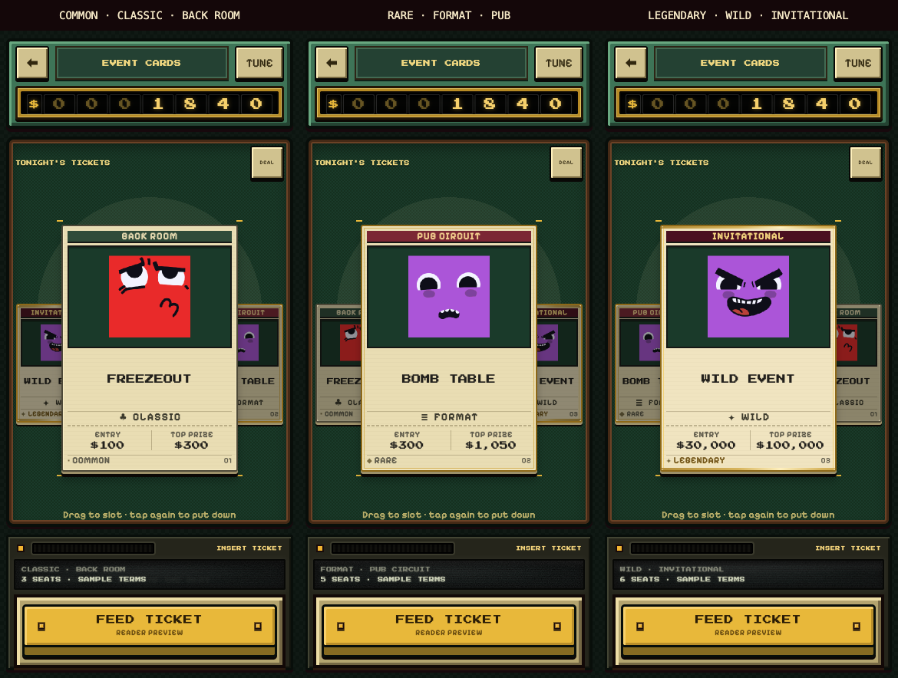

# Career Event Card Visual System Lab

9 October 2026. **Design experiment awaiting owner review**, based on
v0.67.0 (`18de0d4`). Branch: `codex/career-event-card-visual-lab`.
Nothing is integrated into production Career.

## Approved scope

The owner approved Phase 2 (isolated implementation) and Phase 3 (rendered
Visual Gauntlet), after the audit. Start with the Hub Lab's three-card deal,
physical pickup and reader, then improve card scale and selected inspection.
No production navigation, poker, catalogue, transactions or saves change.

The owner clarified that the three classifications must be independent:

| Layer | Values | Visual job |
| --- | --- | --- |
| Rarity | Common, Uncommon, Rare, Legendary | Stock and printed finish; same construction |
| Category | Classic, Format, Wild, Chaos, Rival, Variant | Printed gameplay word and small mark |
| Venue | Back Room, Pub, Card Club, Casino, High Roller, Invitational | Printed header band; venue does not choose rarity |

These are presentation classifications, not implemented gameplay modes.
Changing a venue in TUNE deliberately leaves fixture stakes unchanged;
the lab does not establish economy or event rules.

## Construction and source materials

All cards share a cream stock, venue band, **8:5 illustration aperture**,
title, category, inspection terms and rarity footer. Selected cards are
laid out at a larger width, rather than magnifying tiny rendered lettering.
Artwork stays in the same aperture across every combination.

- Common: ordinary cream stock and dark trim.
- Uncommon: slightly lighter stock and a warmer printed trim.
- Rare: brass print and a fine inner metallic line.
- Legendary: warm stock, a lightly embossed rarity label and narrow foil
  strips at the top and bottom. A finite stepped reflection runs on pickup;
  tilt moves the reflection. No glow, particle layer or fantasy ornament.

The existing Pixelify Sans / Press Start 2P fonts, checker cabinet, felt,
bankroll reel, cream keys, cartridge cradle and reader come from the real
game and `css/hub-lab.css`. The readout uses the actual `.crt`,
`.crt-caption`, `.crt-line` roles without a new CRT finish. Motion derives
from `js/hub-lab.js`: spring pickup, limited lean, squash deal and six
reader bites. Shade is an opacity overlay, avoiding the per-frame filter
shimmer previously rejected on iOS.

Actual game portraits are temporary art: `red-thinking01.PNG`,
`0242-worried.PNG`, `0259-gloating.PNG` in `assets/faces/`. TUNE can replace
all portraits with a clean YOUR ART aperture. No generated illustration.

The three initial fixtures are Back Room Freezeout (Common / Classic /
Back Room), Bomb Table (Rare / Format / Pub), and Wild Event (Legendary /
Wild / Invitational). Their displayed entry, payout and seat numbers are
explicitly sample terms. The shorter FREEZEOUT title shares the Back Room
venue header; its accessible name retains the full event title.

## Try it

Open `event-card-lab.html` from a static server at the repository root.
For this review the local preview is
<http://127.0.0.1:8767/event-card-lab.html>.

Tap a ticket to inspect; tap again or use the left key to put it down.
Carry it to the actual reader mouth or press FEED TICKET. Intake reads
and returns the card, with **no event entry or charge**. DEAL replays the
three-card deal. TUNE changes each axis independently and includes
Legendary Classic / Common Wild examples, artwork and sound controls.
Arrow keys select; Escape puts down a card or closes TUNE. TUNE traps and
restores focus. Reduced motion removes the travel, tilt and foil animation.

`js/hub-lab-host.js` is reused unchanged: the game runs as a document copy,
with its storage replaced by memory before game scripts load and its
service worker removed. The new controller never calls Career entry,
navigation, transaction or persistence functions. Bankroll is a static
fixture. Production `index.html` and `sw.js` do not reference the new files.

The existing `validation/tools/lab-bundle.js` also successfully stages a
5.4 MB, 166-file bundle, and its baked `game.html` was touch-tested. The
repository's private Artifact publisher is unavailable in this session;
the owner explicitly requested a playable local preview, which is supplied.
No public deployment or merge is authorised by this experiment.

## Visual Gauntlet

One separate critical pass over actual Chromium renders, compared with
production Home, production Career and the previous Hub Lab; then one
targeted correction pass and final captures. No claim of owner sign-off.

| Criticism | Correction / outcome |
| --- | --- |
| At 320px the normal-card stock clipped rarity/footer text | Tighter internal spacing and explicit thumbnail lettering; final footers fit |
| At 375×667 the selected shadow crowded the inspection hint | Reserve more vertical room and shorten the hint to one line |
| Risk of treating selection as another rarity finish | Separate corner brackets and lift shadow; rarity trim stays visible |
| Legendary could become a glowing fantasy frame | Restrained printed line and 3px foil strips; no surrounding glow |
| Old Hub release handler accepted a drop based only on Y; cancellation could feed | Actual mouth X/Y bounds and explicit cancellation return, tested with real touch events |
| Tiny targets and perpetual motion could hurt phone use | Keys and sheet controls at least 44px; feed 50–56px; springs stop when settled, reduced motion supported |

Final dimensions and fit checks:

| Viewport | Normal card | Selected card | Feed key bottom |
| --- | --- | --- | --- |
| 390×844 | 111×155 | 230×322 | 804 |
| 430×932 | 120×168 | 230×322 | 892 |
| 375×667 | 106×148 | 176×246 | 627 |
| 320×700 | 88×123 | 180×252 | 660 |

All four sizes were captured in the normal state and with each of the
three cards selected. Final checks found no horizontal overflow, stock
overflow or clipped footer, and no browser page errors. Full sample terms
are intentionally inspected at the larger selected size. Physical Safari
feel and the owner's own artwork remain for owner review on an iPhone;
Chromium emulation is not a real-device sign-off.

## Rendered evidence

All images below are actual browser screenshots. The three-card comparison
only places three independent 390×844 captures beside each other.

| Size | Normal | Common selected | Rare selected | Legendary selected |
| --- | --- | --- | --- | --- |
| 390×844 | [normal](../ui/event-card-lab/normal-390.png) | [Common](../ui/event-card-lab/selected-390-0.png) | [Rare](../ui/event-card-lab/selected-390-1.png) | [Legendary](../ui/event-card-lab/selected-390-2.png) |
| 430×932 | [normal](../ui/event-card-lab/normal-430.png) | [Common](../ui/event-card-lab/selected-430-0.png) | [Rare](../ui/event-card-lab/selected-430-1.png) | [Legendary](../ui/event-card-lab/selected-430-2.png) |
| 375×667 | [normal](../ui/event-card-lab/normal-375.png) | [Common](../ui/event-card-lab/selected-375-0.png) | [Rare](../ui/event-card-lab/selected-375-1.png) | [Legendary](../ui/event-card-lab/selected-375-2.png) |
| 320×700 | [normal](../ui/event-card-lab/normal-320.png) | [Common](../ui/event-card-lab/selected-320-0.png) | [Rare](../ui/event-card-lab/selected-320-1.png) | [Legendary](../ui/event-card-lab/selected-320-2.png) |

Cross-axis examples: [Legendary Classic](../ui/event-card-lab/legendary-classic.png),
[Common Wild with placeholder](../ui/event-card-lab/common-wild.png).
Baseline comparisons: [Home](../ui/event-card-lab/production-home-390.png),
[Career](../ui/event-card-lab/production-career-390.png),
[Hub Lab](../ui/event-card-lab/hub-before-390.png).
Criticised first pass: [320 normal](../ui/event-card-lab/round1-normal-320.png),
[375 selected](../ui/event-card-lab/round1-selected-375-2.png).

## Verification and handoff

- Before changes: `npm test`, 25/25 suites passed (245s).
- After implementation/corrections: `npm test`, 26/26 passed (251s), scoring
  audit zero divergences. Includes 150 new classification/isolation checks.
- Browser: all 144 classifications rendered through the TUNE controls;
  keyboard selection, dialog focus wrap/return and reduced-motion feed pass.
- Real touch events: tap selection, valid mouth drop, drop outside mouth
  and pointer cancellation pass; card returns and bankroll remains unchanged.
- Persistent parent storage sentinel survives; no game save keys appear in
  persistent storage. Baked bundle loads and touch selection passes.

Next: owner reviews the cards and independent classifications in the lab.
Card finishes remain experimental and are **not** added to the approved
Pattern Book. Production integration, event rules, collection data,
Vendor/Case work and a merge require a separate owner decision.
